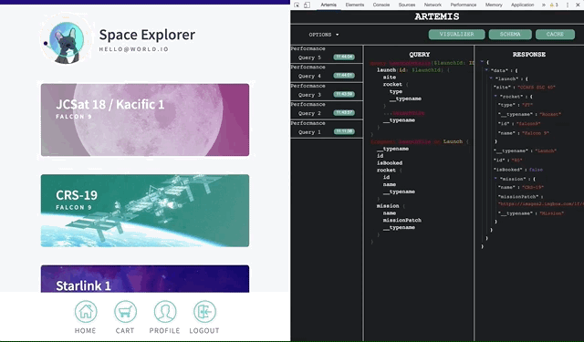

# Artemis-dev-tool
[](https://snyk.io/test/github/ArtemisLabsLLP/Artemis-dev-tool?targetFile=package.json) 

<p align="center">
  
</p>

Project Artemis is an Open Sourced client developer tool for single endpoint testing of GraphQL queries (w/wo Apollo Client). Query endpoint testing and cache management can be done in real time for instant engineering feedback without the need for backend resolvers.

Debug and test query mutations and calls using introspection

The web based extension is best used for React and Express products/applications in development mode, and is available at the chrome store.

## Install
### 1. Chrome store
- Go to [Chrome Web Store](https://chrome.google.com/webstore/detail/redux-devtools/lmhkpmbekcpmknklioeibfkpmmfibljd);
Simply go to the chrome web store and download:
- Add to Chrome

### 2. Working with actual code base
- Fork the repo to your repositories
- build the project 
```bash
npm install
npm run build
```
- Open chrome and direct to chrome://extension
- Enable developer mode 
- click LOAD UNPACKED and upload build folder 

## How to use
Open the application that you want to inspect with chrome and open chrome's inspector window. Artemis will appear and will render once a GraphQL query is detected from the site. If a website or hosted site you are currently testing contains Apollo Client, you should be able to see its inMemory cache. Otherwise, it will display empty object.

## Core features
- Display schema, query, and GraphQL response with endpoint detection

<p align="center">
  
</p>


- Query caching and component storage- View normalized Apollo Client cache in JSON Format

<p align="center">
  
</p>

- Query response Snapshot feature

<p align="center">
  
</p>

- View Response and Query Visualizer tree in inspection window

<p align="center">
  
</p>

## Contributing
Project Artemis is still in Beta, a subset project of OS-Labs. We encourage you to submit issues for any bugs or ideas for enhancements. Also feel free to fork this repo and submit pull requests to contribute as well. 

## Technologies used 
- React 
- Typescript
- GraphQL
- D3
- Jest
- Enzyme
- Travis CI

All rights Reserved Artemis Labs

